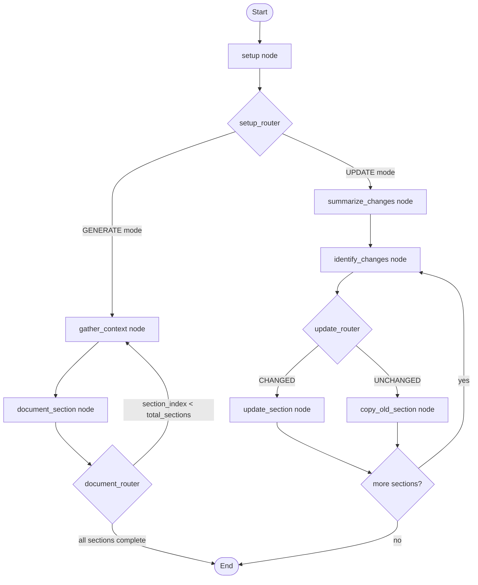

# Reverse Document Generator — Flask Server

> **archie-job-reverse-document-generator** — An AI-powered documentation engine that automatically generates and incrementally updates comprehensive technical specifications from source code repositories. Built with Python 3.12, Flask 3.1.2, and LangGraph for multi-agent orchestration.

[](https://www.python.org/downloads/release/python-3123/)
[](https://flask.palletsprojects.com/)
[](https://langchain-ai.github.io/langgraph/)

---

## Table of Contents

- [Overview](#overview)
- [System Architecture](#system-architecture)
- [LangGraph Workflow](#langgraph-workflow)
- [Prerequisites](#prerequisites)
- [Installation](#installation)
- [Environment Variables](#environment-variables)
- [API Reference](#api-reference)
- [Development Guide](#development-guide)
- [Docker Setup](#docker-setup)
- [Deployment](#deployment)
- [Testing](#testing)
- [Project Structure](#project-structure)
- [Features](#features)
- [Error Handling](#error-handling)

---

## Overview

The Reverse Document Generator is a Flask-based REST API service that leverages a multi-agent LangGraph workflow to produce and maintain technical specification documents from source code repositories. The system operates in two modes:

- **GENERATE Mode** — Produces a complete technical specification from scratch by ingesting repository source code, constructing a Neo4j code graph, and orchestrating AI agents (Claude Opus 4.6, GPT-5 Mini) to author each document section sequentially.
- **UPDATE Mode** — Incrementally updates an existing technical specification by analyzing code changes, classifying affected sections (CHANGED/UNCHANGED), and selectively rewriting only the impacted portions with highlighted modifications.

The server exposes REST endpoints that accept document generation or update requests, dispatch them as background jobs, and provide real-time progress tracking via polling endpoints and Pub/Sub notifications.

### Key Capabilities

- **12+ External Service Integrations** — Anthropic (Claude Opus 4.6), OpenAI (GPT-5 Mini), Voyage AI (embeddings), Google Gemini (alternative), Neo4j (code graph), GitHub (repository download), Google Cloud Storage (document persistence), Cloud Pub/Sub (progress notifications), Admin Service (project metadata), Figma API (design assets, conditional), LangSmith (tracing), and Mermaid Server (diagram validation, currently disabled).
- **7-Node LangGraph StateGraph** — Deterministic, sequential workflow with conditional routing for both GENERATE and UPDATE paths.
- **Incremental Persistence** — Documents are uploaded to GCS after every section completion, ensuring partial result recovery on mid-execution failures.
- **Multi-Layered Error Handling** — 5-layer retry architecture including exponential backoff, content validation, state restoration, infrastructure recovery, and guaranteed resource cleanup.

---

## System Architecture

```
┌───────────────────────────────────────────────────────────────────────┐
│                        Flask REST API Layer                          │
│  ┌─────────────────┐  ┌──────────────────┐  ┌────────────────────┐  │
│  │  Documents API   │  │    Jobs API       │  │   Health API       │  │
│  │ POST /generate   │  │ GET /status       │  │ GET /health        │  │
│  │ POST /update     │  │ GET /progress     │  │ GET /ready         │  │
│  └────────┬────────┘  └────────┬─────────┘  └────────────────────┘  │
│           │                    │                                      │
│  ┌────────▼────────────────────▼─────────────────────────────────┐   │
│  │                     Job Manager                                │   │
│  │         Thread-safe job registry and background execution      │   │
│  └────────────────────────────┬──────────────────────────────────┘   │
└───────────────────────────────┼──────────────────────────────────────┘
                                │
┌───────────────────────────────▼──────────────────────────────────────┐
│                  LangGraph StateGraph Engine                         │
│  ┌─────────┐  ┌───────────────┐  ┌──────────────────┐               │
│  │  setup   │─▶│gather_context │─▶│ document_section  │──┐ GENERATE  │
│  └─────────┘  └───────────────┘  └──────────────────┘  │ loop      │
│       │                                    ▲            │            │
│       │                                    └────────────┘            │
│       │       ┌──────────────────┐  ┌──────────────────┐            │
│       └──────▶│summarize_changes │─▶│identify_changes  │──┐ UPDATE  │
│               └──────────────────┘  └──────────────────┘  │ path    │
│               ┌──────────────────┐  ┌──────────────────┐  │         │
│               │ update_section   │◀─┤copy_old_section  │◀─┘         │
│               └──────────────────┘  └──────────────────┘            │
└──────────────────────────────────────────────────────────────────────┘
                                │
┌───────────────────────────────▼──────────────────────────────────────┐
│                    External Service Integrations                     │
│  ┌──────────┐ ┌──────────┐ ┌──────────┐ ┌──────────┐ ┌──────────┐  │
│  │ Anthropic│ │  OpenAI  │ │Voyage AI │ │  Neo4j   │ │  GitHub  │  │
│  │Claude 4.6│ │GPT-5 Mini│ │Embeddings│ │Code Graph│ │Repo DL   │  │
│  └──────────┘ └──────────┘ └──────────┘ └──────────┘ └──────────┘  │
│  ┌──────────┐ ┌──────────┐ ┌──────────┐ ┌──────────┐ ┌──────────┐  │
│  │   GCS    │ │ Pub/Sub  │ │  Admin   │ │  Figma   │ │LangSmith │  │
│  │ Storage  │ │ Notify   │ │ Service  │ │MCP Bridge│ │ Tracing  │  │
│  └──────────┘ └──────────┘ └──────────┘ └──────────┘ └──────────┘  │
└──────────────────────────────────────────────────────────────────────┘
```

The application follows a layered architecture:

1. **REST API Layer** — Flask Blueprints handle HTTP requests, validate payloads via Pydantic, and dispatch work to the Job Manager.
2. **Job Manager** — Thread-safe background execution engine that manages concurrent document generation jobs with status tracking.
3. **LangGraph Workflow Engine** — The core business logic: a 7-node `StateGraph` with 3 conditional routers orchestrating AI agents for document generation and updates.
4. **External Service Integrations** — Dedicated service classes wrapping each of the 12+ external dependencies with proper connection lifecycle management.

---

## LangGraph Workflow

The core document processing pipeline is implemented as a LangGraph `StateGraph` with 7 nodes and 3 conditional routers. The workflow operates with `recursion_limit=500` and enforces `parallel_tool_calls=False` for deterministic sequential execution.



### Node Descriptions

| Node | Agent/LLM | Purpose |
|------|-----------|---------|
| `setup` | — | Downloads repository, builds Neo4j code graph, initializes state, downloads document prompt and existing tech spec from GCS |
| `gather_context` | Claude Opus 4.6 (Context Gatherer Agent) | Gathers relevant source code context for the current section using 7+ search tools |
| `document_section` | Claude Opus 4.6 (Author Agent) | Writes the current document section based on gathered context |
| `summarize_changes` | Claude Opus 4.6 | Creates an Agent Action Plan summarizing code changes between old and new repositories (UPDATE mode) |
| `identify_changes` | GPT-5 Mini | Classifies each section as CHANGED or UNCHANGED using structured output (UPDATE mode) |
| `update_section` | Claude Opus 4.6 | Rewrites changed sections with highlighted modifications (UPDATE mode) |
| `copy_old_tech_spec_section` | — | Preserves unchanged sections verbatim using `thefuzz` fuzzy heading matching (UPDATE mode) |

### Tool Subsystem

| Category | Tool Count | Tools |
|----------|-----------|-------|
| **Search Tools** | 8 | `get_tech_spec_section`, `get_source_folder_contents`, `get_file_summary`, `read_file`, `search_files`, `search_folders`, web search, bash |
| **Author Tools** | 2 | `get_tech_spec_section`, web search |
| **Document Tools** | 2 | `add_tech_spec_sub_section`, `mark_tech_spec_sub_section_complete` |

---

## Prerequisites

Ensure the following are installed on your system before proceeding:

| Requirement | Version | Purpose |
|-------------|---------|---------|
| **Python** | 3.12.3+ | Application runtime |
| **Node.js** | 20.20.0 LTS | MCP bridge for Figma and Chrome DevTools integration |
| **Chrome** | 144+ | Chrome DevTools MCP server for Figma asset processing |
| **Docker** | 24+ | Containerized development and deployment |
| **Docker Compose** | 2.20+ | Local development environment orchestration |
| **Google Cloud SDK** | Latest | Cloud Run Service deployment (`gcloud`) |
| **Make** | GNU Make 4+ | Build and task automation |

---

## Installation

### 1. Clone the Repository

```bash
git clone https://github.com/your-org/archie-job-reverse-document-generator.git
cd archie-job-reverse-document-generator
```

### 2. Create a Virtual Environment

```bash
python3.12 -m venv venv
source venv/bin/activate
```

### 3. Install Dependencies

Production dependencies:

```bash
pip install -r requirements.txt
```

Development and testing dependencies:

```bash
pip install -r requirements-dev.txt
```

Or use the Makefile shortcut:

```bash
make init
```

> **Note:** The `blitzy-platform-shared==0.0.542` package is hosted on Google Artifact Registry. Ensure you have authenticated with `gcloud auth application-default login` and configured the `keyring` package for Artifact Registry access before running `pip install`.

### 4. Configure Environment Variables

```bash
cp .env.example .env
# Edit .env with your actual service credentials
```

See the [Environment Variables](#environment-variables) section for a complete reference.

### 5. Start the Development Server

```bash
make run
```

This starts the Flask development server on `http://localhost:8080`.

---

## Environment Variables

All configuration is managed through environment variables. Copy `.env.example` to `.env` and populate with your credentials.

### Flask Configuration

| Variable | Required | Default | Description |
|----------|----------|---------|-------------|
| `FLASK_APP` | Yes | `app.main:application` | Flask application entry point |
| `FLASK_ENV` | No | `production` | Environment mode (`development`, `staging`, `production`) |
| `FLASK_SECRET_KEY` | Yes | — | Secret key for session security (change in production) |

### AI / LLM Service Keys

| Variable | Required | Default | Description |
|----------|----------|---------|-------------|
| `ANTHROPIC_API_KEY` | Yes | — | Anthropic API key for Claude Opus 4.6 (primary LLM for context gathering, authoring, and diagrams) |
| `OPENAI_API_KEY` | Yes | — | OpenAI API key for GPT-5 Mini (section change classification in UPDATE mode) |
| `VOYAGE_API_KEY` | Yes | — | Voyage AI API key for embedding generation used in Neo4j semantic search |
| `GOOGLE_API_KEY` | No | — | Google API key for Gemini (alternative Architect LLM, optional) |

### Neo4j Code Graph Database

| Variable | Required | Default | Description |
|----------|----------|---------|-------------|
| `NEO4J_SERVER` | Yes | `neo4j://localhost:7687` | Neo4j Bolt protocol connection URI |
| `NEO4J_USERNAME` | Yes | `neo4j` | Neo4j authentication username |
| `NEO4J_PASSWORD` | Yes | — | Neo4j authentication password |

### Google Cloud Platform

| Variable | Required | Default | Description |
|----------|----------|---------|-------------|
| `PROJECT_ID` | Yes | — | GCP project ID (e.g., `blitzy-os-dev`) |
| `GCS_BUCKET_NAME` | Yes | — | GCS bucket for document storage (e.g., `blitzy-os-internal`) |
| `PRIVATE_BLOB_NAME` | Yes | `private-src` | GCS blob prefix for private source files |
| `PLATFORM_EVENTS_TOPIC` | Yes | `platform-events` | Pub/Sub topic for progress and completion notifications |

### External Services

| Variable | Required | Default | Description |
|----------|----------|---------|-------------|
| `SERVICE_URL_ADMIN` | Yes | — | Admin Service base URL for project metadata, attachments, build info, and Figma data |
| `GITHUB_SECRET_SERVER` | Yes | — | GitHub Secret Server URL for authenticated repository downloads |

### Observability and Tracing

| Variable | Required | Default | Description |
|----------|----------|---------|-------------|
| `LANGSMITH_TRACING` | No | `true` | Enable LangSmith LLM tracing |
| `LANGSMITH_ENDPOINT` | No | `https://api.smith.langchain.com` | LangSmith API endpoint |
| `LANGSMITH_API_KEY` | No | — | LangSmith API key for trace submission |
| `LANGSMITH_PROJECT` | No | `reverse-document-generator` | LangSmith project name for trace grouping |

### Application Settings

| Variable | Required | Default | Description |
|----------|----------|---------|-------------|
| `TOKENIZERS_PARALLELISM` | No | `false` | Disable tokenizer parallelism warnings in forked processes |
| `PORT` | No | `8080` | HTTP port for Flask/Gunicorn server binding |
| `WEB_CONCURRENCY` | No | `2` | Number of Gunicorn worker processes |

---

## API Reference

All API endpoints return JSON responses. The base URL prefix for business endpoints is `/api/v1/`.

### Document Generation

#### `POST /api/v1/documents/generate`

Triggers a new GENERATE mode document creation job. Returns immediately with a job ID for status polling.

**Request Body:**

```json
{
    "user_id": "string (required)",
    "company_id": "string (required)",
    "team_id": "string (optional)",
    "project_id": "string (required)",
    "repo_name": "string (required)",
    "branch_name": "string (optional, default: main)",
    "document_mode": "GENERATE",
    "tech_spec_id": "string (required)",
    "tech_spec_version": "string (optional)",
    "document_prompt": "string (optional)",
    "is_figma_available": "boolean (optional, default: false)",
    "attachments": "array (optional)",
    "build_id": "string (optional)",
    "callback_url": "string (optional)"
}
```

**Response — `202 Accepted`:**

```json
{
    "job_id": "uuid-string",
    "status": "PENDING",
    "message": "Document generation job queued successfully",
    "created_at": "2025-01-01T00:00:00Z"
}
```

**Error — `400 Bad Request`:**

```json
{
    "error": "VALIDATION_ERROR",
    "message": "Request validation failed",
    "details": [
        {"field": "user_id", "message": "Field is required"}
    ]
}
```

---

#### `POST /api/v1/documents/update`

Triggers a new UPDATE mode incremental document update job. Requires the previous tech spec ID for change analysis.

**Request Body:**

```json
{
    "user_id": "string (required)",
    "company_id": "string (required)",
    "team_id": "string (optional)",
    "project_id": "string (required)",
    "repo_name": "string (required)",
    "branch_name": "string (optional, default: main)",
    "document_mode": "UPDATE",
    "tech_spec_id": "string (required)",
    "previous_tech_spec_id": "string (required)",
    "tech_spec_version": "string (optional)",
    "document_prompt": "string (optional)",
    "is_figma_available": "boolean (optional, default: false)",
    "attachments": "array (optional)",
    "build_id": "string (optional)",
    "callback_url": "string (optional)"
}
```

**Response — `202 Accepted`:**

```json
{
    "job_id": "uuid-string",
    "status": "PENDING",
    "message": "Document update job queued successfully",
    "created_at": "2025-01-01T00:00:00Z"
}
```

---

### Job Management

#### `GET /api/v1/jobs/{job_id}/status`

Returns the current status of a background document generation or update job.

**Response — `200 OK`:**

```json
{
    "job_id": "uuid-string",
    "status": "IN_PROGRESS",
    "document_mode": "GENERATE",
    "created_at": "2025-01-01T00:00:00Z",
    "updated_at": "2025-01-01T00:05:00Z",
    "error": null
}
```

**Status Values:** `PENDING`, `IN_PROGRESS`, `COMPLETE`, `FAILED`

**Error — `404 Not Found`:**

```json
{
    "error": "NOT_FOUND",
    "message": "Job with ID 'uuid-string' not found"
}
```

---

#### `GET /api/v1/jobs/{job_id}/progress`

Returns detailed progress information for an active job, including section-level tracking.

**Response — `200 OK`:**

```json
{
    "job_id": "uuid-string",
    "status": "IN_PROGRESS",
    "current_index": 3,
    "total_steps": 12,
    "percentage": 25.0,
    "current_section": "Database Design",
    "section_headings": [
        "Executive Summary",
        "System Overview",
        "Database Design"
    ],
    "started_at": "2025-01-01T00:00:00Z"
}
```

---

### Health and Readiness

#### `GET /health`

Liveness probe. Returns `200 OK` if the Flask server process is running.

**Response — `200 OK`:**

```json
{
    "status": "healthy",
    "timestamp": "2025-01-01T00:00:00Z"
}
```

---

#### `GET /ready`

Readiness probe. Verifies connectivity to critical dependencies: Neo4j database, LLM client initialization, and GCS reachability.

**Response — `200 OK`:**

```json
{
    "status": "ready",
    "checks": {
        "neo4j": "connected",
        "llm_clients": "initialized",
        "gcs": "reachable"
    },
    "timestamp": "2025-01-01T00:00:00Z"
}
```

**Response — `503 Service Unavailable`:**

```json
{
    "status": "not_ready",
    "checks": {
        "neo4j": "disconnected",
        "llm_clients": "initialized",
        "gcs": "reachable"
    },
    "timestamp": "2025-01-01T00:00:00Z"
}
```

---

## Development Guide

### Running Locally

Start the Flask development server with hot-reload:

```bash
make run
```

This runs `flask run --host=0.0.0.0 --port=8080 --reload` with `FLASK_ENV=development`.

### Running Tests

Execute the full test suite with coverage:

```bash
make test
```

This runs `pytest --cov=app --cov-report=term-missing -v tests/` with `--watchAll=false`.

Run only unit tests:

```bash
pytest tests/unit/ -v
```

Run only integration tests:

```bash
pytest tests/integration/ -v
```

### Linting and Formatting

Check code style compliance:

```bash
make lint
```

This runs both `flake8` (linting) and `black --check` (format verification).

Auto-format code:

```bash
black app/ tests/
```

### Available Make Targets

| Target | Command | Description |
|--------|---------|-------------|
| `make run` | `flask run` | Start development server on port 8080 |
| `make test` | `pytest` | Run full test suite with coverage |
| `make lint` | `flake8` + `black --check` | Check code style |
| `make build` | `docker build` | Build production Docker image |
| `make deploy` | `gcloud run services deploy` | Deploy to Cloud Run Service |
| `make clean` | `docker rmi` | Remove built Docker images |
| `make init` | `pip install -r requirements-dev.txt` | Install all dependencies |

---

## Docker Setup

### Local Development with Docker Compose

Start the full local development stack (Flask app + Neo4j):

```bash
docker-compose up
```

This starts:

- **Flask Application** — `http://localhost:8080` — The REST API server with hot-reload
- **Neo4j Database** — `http://localhost:7474` (browser), `neo4j://localhost:7687` (Bolt) — Code graph database

Stop the stack:

```bash
docker-compose down
```

### Building the Production Image

```bash
make build
```

Or manually:

```bash
DOCKER_BUILDKIT=1 docker build \
    --secret id=google_credentials,src=$HOME/.config/gcloud/application_default_credentials.json \
    -t archie-job-reverse-document-generator:latest .
```

The production Docker image is based on **Ubuntu 24.04** and includes:

- Python 3.12.3
- Node.js 20.20.0 LTS (for MCP bridge subprocess)
- Chrome 144+ (for Figma/Chrome DevTools MCP integration)
- Gunicorn WSGI server

### Running the Production Image Locally

```bash
docker run -p 8080:8080 --env-file .env archie-job-reverse-document-generator:latest
```

---

## Deployment

### Google Cloud Run Service

The application is deployed as a **Cloud Run Service** (persistent web server), replacing the original Cloud Run Job (batch) deployment model.

#### Prerequisites

1. Authenticate with Google Cloud:

```bash
gcloud auth login
gcloud config set project YOUR_PROJECT_ID
```

2. Configure Docker for Artifact Registry:

```bash
gcloud auth configure-docker us-east1-docker.pkg.dev
```

#### Deploy

Using the Makefile:

```bash
make deploy
```

Or manually via `gcloud`:

```bash
gcloud run services deploy archie-job-reverse-document-generator \
    --image us-east1-docker.pkg.dev/PROJECT_ID/REPOSITORY/archie-job-reverse-document-generator:latest \
    --region us-east1 \
    --platform managed \
    --port 8080 \
    --timeout 3600 \
    --memory 8Gi \
    --cpu 4 \
    --min-instances 0 \
    --max-instances 10 \
    --vpc-connector VPC_CONNECTOR_NAME \
    --vpc-egress all-traffic \
    --service-account SERVICE_ACCOUNT_EMAIL \
    --set-env-vars "ANTHROPIC_API_KEY=...,OPENAI_API_KEY=...,NEO4J_SERVER=..."
```

#### Key Deployment Configuration

| Parameter | Value | Rationale |
|-----------|-------|-----------|
| `--timeout` | `3600` (1 hour) | Long-running LLM operations for document generation |
| `--memory` | `8Gi` | Large context windows (300K tokens) and code graph processing |
| `--cpu` | `4` | Concurrent LLM API calls and Neo4j graph operations |
| `--min-instances` | `0` | Scale to zero when idle to reduce costs |
| `--max-instances` | `10` | Limit concurrent document generation capacity |
| `--vpc-connector` | Configured | Access to internal services (Admin Service, Neo4j) |

#### CI/CD Pipeline

The `.github/workflows/deploy.yml` workflow automates:

1. **Build** — Docker image construction with Artifact Registry authentication
2. **Test** — Full test suite execution with mocked external services
3. **Push** — Image push to Google Artifact Registry
4. **Deploy** — `gcloud run services deploy` to the target environment

---

## Testing

### Test Architecture

Tests are organized into two categories with comprehensive mocking of all 12+ external services:

```
tests/
├── conftest.py                      # Shared fixtures, Flask test client, mock services
├── unit/
│   ├── test_config.py               # Configuration loading and env var mapping
│   ├── test_models.py               # Pydantic model validation and serialization
│   ├── test_content_validator.py    # 5-stage content validation pipeline
│   ├── test_retry.py                # Exponential retry decorator behavior
│   ├── test_routers.py              # Conditional router function logic
│   └── test_job_manager.py          # Thread safety and status tracking
└── integration/
    ├── test_documents_api.py        # GENERATE and UPDATE endpoint tests
    ├── test_jobs_api.py             # Job status and progress polling tests
    ├── test_health_api.py           # Health and readiness probe tests
    └── test_workflow.py             # LangGraph StateGraph execution tests
```

### Running Tests

```bash
# Full suite with coverage
make test

# Unit tests only
pytest tests/unit/ -v

# Integration tests only
pytest tests/integration/ -v

# Specific test file
pytest tests/unit/test_models.py -v

# With coverage report
pytest --cov=app --cov-report=html tests/
```

### Mocking Strategy

All external services are mocked in the test suite. No tests make real API calls:

| Service | Mock Approach |
|---------|--------------|
| Anthropic (Claude Opus 4.6) | `unittest.mock.patch` on LangChain adapter |
| OpenAI (GPT-5 Mini) | `unittest.mock.patch` on structured output call |
| Voyage AI | `unittest.mock.patch` on embedding client |
| Neo4j | `unittest.mock.MagicMock` for Bolt driver and graph builder |
| Google Cloud Storage | `unittest.mock.patch` on GCS SDK client operations |
| Cloud Pub/Sub | `unittest.mock.patch` on PublisherClient |
| GitHub | `unittest.mock.patch` on `download_repository_to_disk()` |
| Admin Service | `unittest.mock.patch` on `ServiceClient` requests |
| Figma | `unittest.mock.patch` on MCPManager |
| LangSmith | Disabled via environment variable in test config |

---

## Project Structure

```
archie-job-reverse-document-generator/
├── app/
│   ├── __init__.py                          # Flask application factory (create_app)
│   ├── main.py                              # Entry point, Gunicorn target
│   ├── config.py                            # Configuration classes (Dev/Staging/Prod)
│   ├── api/
│   │   ├── __init__.py                      # Blueprint registration
│   │   ├── routes/
│   │   │   ├── documents.py                 # POST /generate, POST /update
│   │   │   ├── jobs.py                      # GET /status, GET /progress
│   │   │   └── health.py                    # GET /health, GET /ready
│   │   └── middleware/
│   │       ├── error_handler.py             # Global error handlers
│   │       └── request_validator.py         # Pydantic request validation
│   ├── models/
│   │   ├── __init__.py                      # Model exports
│   │   ├── document.py                      # DocumentSection, DocumentSections
│   │   ├── requests.py                      # GenerateRequest, UpdateRequest
│   │   └── notifications.py                 # Pub/Sub notification payloads
│   ├── services/
│   │   ├── __init__.py                      # Service exports
│   │   ├── job_manager.py                   # Background job execution engine
│   │   ├── workflow/
│   │   │   ├── __init__.py                  # Workflow module init
│   │   │   ├── helper.py                    # ReverseDocumentHelper (StateGraph)
│   │   │   ├── state.py                     # ReverseDocumentState (30+ fields)
│   │   │   ├── nodes.py                     # 7 node implementations
│   │   │   ├── routers.py                   # 3 conditional router functions
│   │   │   ├── tools.py                     # 12 tool definitions
│   │   │   └── prompts.py                   # Agent personas and system prompts
│   │   └── integrations/
│   │       ├── __init__.py                  # Integration module init
│   │       ├── llm_service.py               # Claude, GPT-5, Gemini, Voyage AI
│   │       ├── neo4j_service.py             # Code graph database
│   │       ├── gcs_service.py               # Document storage
│   │       ├── pubsub_service.py            # Progress notifications
│   │       ├── github_service.py            # Repository download
│   │       ├── admin_service.py             # Project metadata
│   │       └── mcp_service.py               # Figma/Chrome MCP bridge
│   └── utils/
│       ├── __init__.py                      # Utility module init
│       ├── retry.py                         # @archie_exponential_retry()
│       ├── content_validator.py             # 5-stage validation pipeline
│       └── attachment_processor.py          # Base64 attachment processing
├── tests/
│   ├── conftest.py                          # Pytest fixtures and mocks
│   ├── unit/                                # Unit tests
│   └── integration/                         # Integration tests
├── requirements.txt                         # Production dependencies
├── requirements-dev.txt                     # Development dependencies
├── Dockerfile                               # Production container
├── docker-compose.yml                       # Local dev environment
├── gunicorn.conf.py                         # WSGI server config
├── pyproject.toml                           # Project metadata and tool config
├── Makefile                                 # Build/test/deploy commands
├── .env.example                             # Environment variable template
├── .github/workflows/deploy.yml             # CI/CD pipeline
└── README.md                                # This file
```

---

## Features

The application implements all 11 documented features from the original system specification:

| ID | Feature | Description |
|----|---------|-------------|
| **F-001** | Repository Ingestion and Code Graph Construction | Downloads source repository via GitHub Secret Server; constructs a Neo4j code graph for semantic code search |
| **F-002** | AI-Powered Context Gathering | Claude Opus 4.6 Context Gatherer Agent uses 7+ search tools to gather relevant code context per section |
| **F-003** | Section-by-Section Document Generation (GENERATE) | Author Agent writes each tech spec section sequentially with incremental GCS persistence |
| **F-004** | Incremental Document Update Pipeline (UPDATE) | Analyzes changes, classifies sections as CHANGED/UNCHANGED, selectively rewrites affected sections |
| **F-005** | Design Asset Integration | Conditional Figma integration via MCP bridge (Node.js subprocess) when `is_figma_available=True` |
| **F-006** | Attachment Processing and Multi-Modal Input | Downloads attachments, converts to Base64, caches, and provides to Claude with ephemeral cache control |
| **F-007** | Real-Time Progress Notifications | Three-tier Pub/Sub notification lifecycle: IN_PROGRESS (initial), IN_PROGRESS (per-section), DONE |
| **F-008** | Document Storage and Persistence | Incremental GCS uploads after every section; final upload on completion; empty-string fallback on download failure |
| **F-009** | Mermaid Diagram Generation and Validation | Generates Mermaid diagrams with validation rules; Mermaid server validation currently disabled |
| **F-010** | LangGraph Workflow Orchestration | 7-node StateGraph with 3 conditional routers, `recursion_limit=500`, deterministic sequential execution |
| **F-011** | Project Environment and Build Information | Integrates project build info and environment files from Admin Service into generated documentation |

---

## Error Handling

The application implements a 5-layer error handling architecture:

### Layer 1 — Application Retry

The `@archie_exponential_retry()` decorator wraps all 5 critical workflow nodes with `tenacity`-based exponential backoff. Exceptions are classified into:

- **RETRYABLE_EXCEPTIONS** — Transient failures (API timeouts, rate limits) that trigger automatic retry with backoff
- **SUPPLEMENTARY_RETRYABLE_EXCEPTIONS** — Additional retryable conditions from the shared library
- **Non-retryable exceptions** — Permanent failures logged and re-raised immediately

### Layer 2 — Content Validation

A 5-stage validation pipeline is applied to every generated or updated section:

1. **Non-empty check** — Ensures content is not blank
2. **Delimiter pairing verification** — Validates matching code fences and block delimiters
3. **Content cleaning** — Removes artifacts and normalizes formatting
4. **Heading format validation** — Ensures proper Markdown heading hierarchy
5. **First-section structure check** — Validates the opening section structure

### Layer 3 — State Restoration (UPDATE Mode)

If an UPDATE mode section update fails, the system restores the previous section content from the existing tech spec, ensuring no data loss.

### Layer 4 — Infrastructure Recovery

Cloud Run Service provides automatic container restart on unrecoverable crashes. The Gunicorn WSGI server manages worker process health.

### Layer 5 — Resource Cleanup

Neo4j database connections are guaranteed to close via `finally` blocks, preventing connection pool exhaustion. The MCP bridge subprocess is properly terminated on application shutdown.

### HTTP Error Responses

| Status Code | Meaning | When Returned |
|-------------|---------|---------------|
| `202 Accepted` | Job dispatched successfully | POST /generate, POST /update |
| `400 Bad Request` | Invalid request payload | Pydantic validation failure |
| `404 Not Found` | Resource not found | Unknown job ID |
| `500 Internal Server Error` | Unrecoverable server error | Unexpected exceptions |
| `503 Service Unavailable` | Service not ready | Readiness check failure |

---

## License

This project is proprietary software. All rights reserved.
